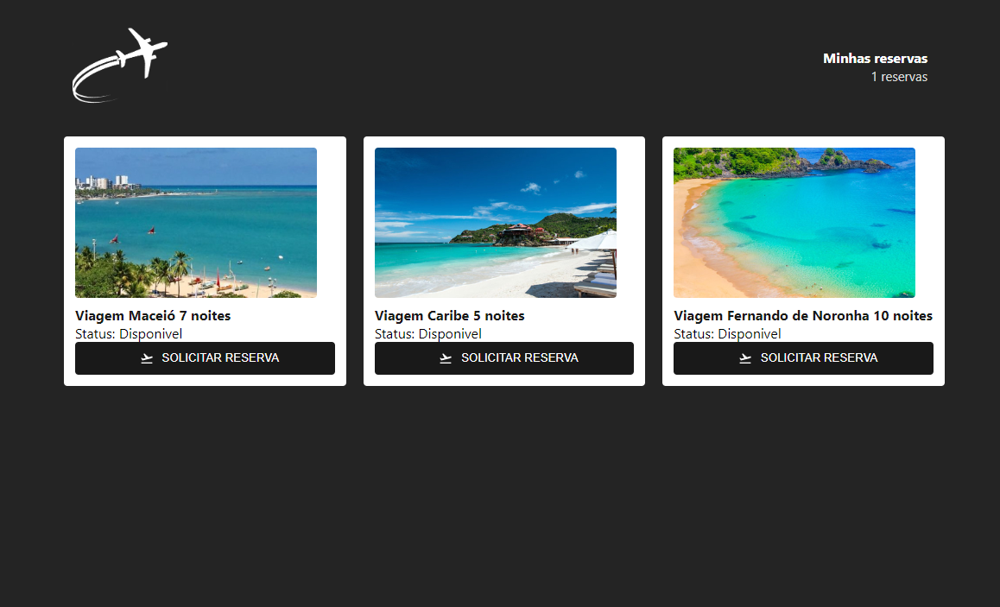
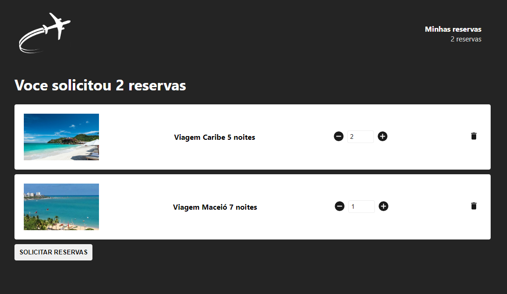

# Projeto página de Web de reserva de viagens.

Neste projeto, você consegue visualizar os pacotes de viagens disponíveis, solicitar a reserva do pacote de viagem que desejar

E também visualizar as suas reservas adquiridas, assim como excluí-las.

## Algumas observações

Foram utilizadas várias bibliotecas nesse projeto, irei citar algumas e explicá-las.

# Bibliotecas Utilizadas -->
- [x] react-router-dom@5
- [x] react-icons
- [x] axios
- [x] redux
- [x] react-redux
- [x] redux-saga
- [x] -g json-server